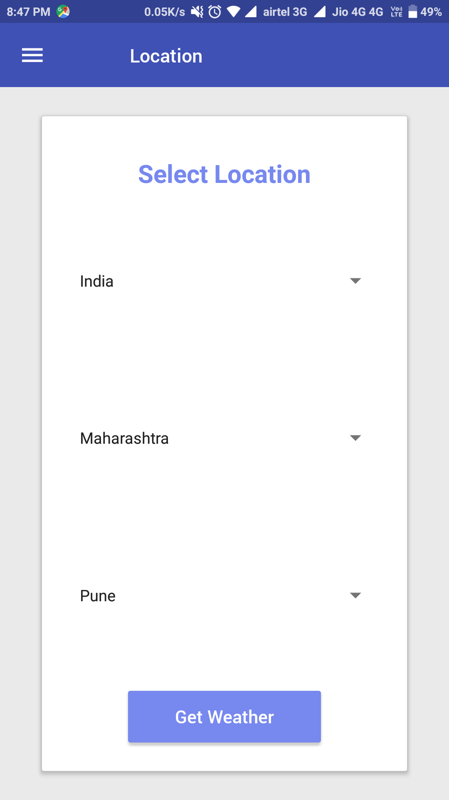
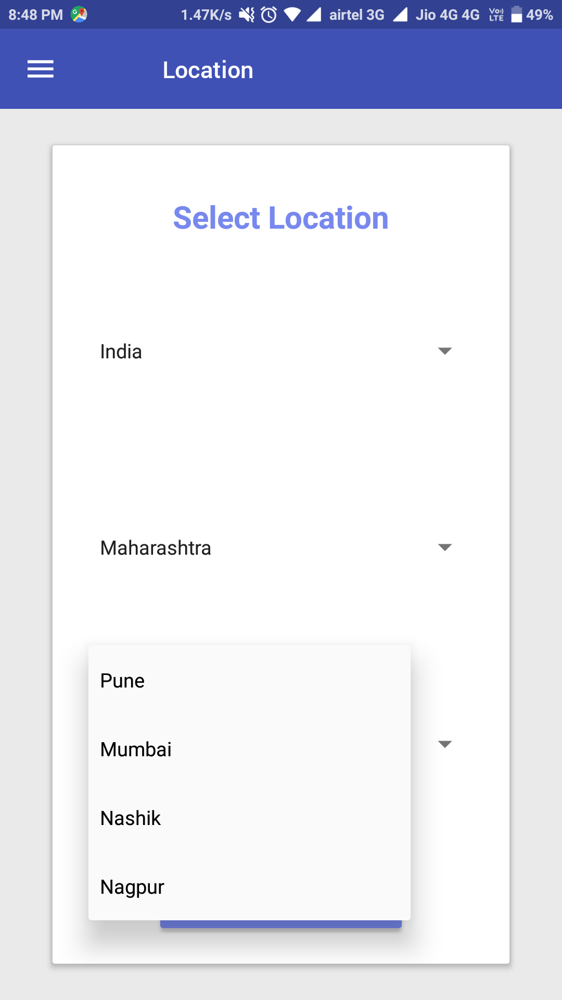
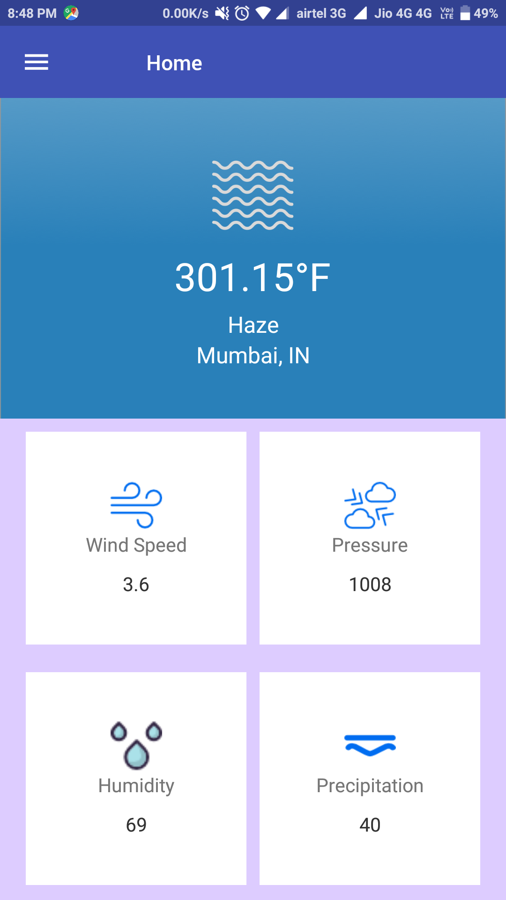
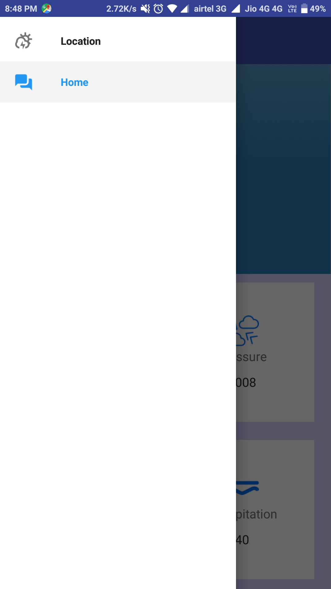

## React Native Waether App.

 This is the React-native mobile app where you can select Contry, State and City and you will get the weather details for that city.








#### Pre-requsites: 
 
**Get API key from [openweathermap](https://api.openweathermap.org/api), Also can refer for API Documentations.**

### Setup
To set-up the project: 
```sh
$ git clone git@github.com:dev-pacific22/react-native-weather-app.git
$ cd react-native-weather-app
$ npm install 
$ react-native run-android
```

#### Third party libraries used: 

* [react-navigation](https://reactnavigation.org/) - Navigation library.
* [native-base](http://nativebase.io) - UI component library
* [firebase](https://console.firebase.google.com) - Used for backend authentication and backend database storage.
* [axios](https://github.com/axios/axios) - Used for Server communication.


License
----
**MIT License**
**Copyright (c) 2018 Bhagwat Karankar**
